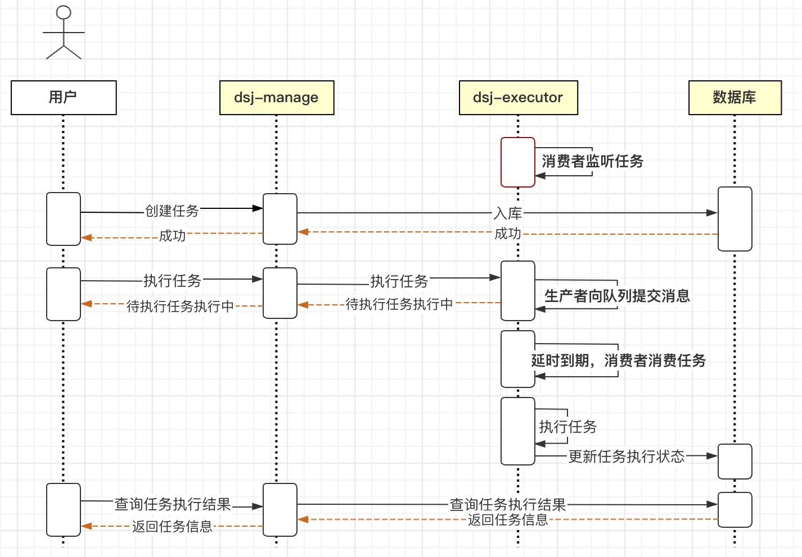
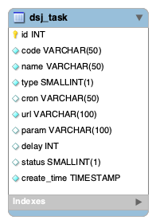

# distributed-scheduled-job 分布式定时任务
> 主要功能是可以实时、延时、定时调用rest接口，提供分布式调度功能。

## 主要模块

### dsj-manage

面向用户，给用户提供管理任务的各种接口

- 新增任务（默认待执行）
- 删除任务
- 执行任务
- 取消任务
- 分页查询任务
- 一键执行所有待执行任务（待做）

### dsj-executor

面向任务，根据用户下的指令对任务进行处理

#### 核心类介绍
- DelayTaskExecutor   延时任务管理器

根据DelayQueue的延时阻塞队列功能，采用生产者、消费者模式。生产者收到用户的任务指令后，向队列中提交DelayTask延时任务。应用启动后，消费者自动监听队列中的任务，延时任务到期后自动执行，根据执行结果维护任务状态。

### dsj-service

面向数据库中的业务逻辑

### dsj-common

常用工具包

## 时序图



## 数据库设计

dsj_task 任务表



```sql
CREATE TABLE IF NOT EXISTS `dsj`.`dsj_task` (
         `id` INT UNSIGNED NOT NULL AUTO_INCREMENT COMMENT 'Id',
         `code` VARCHAR(50) NOT NULL COMMENT '任务编码',
         `name` VARCHAR(50) NOT NULL COMMENT '任务名称',
         `type` SMALLINT(1) NOT NULL COMMENT '任务类型：1-实时执行；2-cron执行；3-延时执行',
         `cron` VARCHAR(50) NULL COMMENT '定时任务表达式',
         `url` VARCHAR(100) NOT NULL COMMENT '任务地址',
         `param` VARCHAR(100) NULL COMMENT '参数',
         `delay` INT NULL COMMENT '延时执行时间（ms）',
         `status` SMALLINT(1) NULL DEFAULT 1 COMMENT '状态：1-待执行；2-执行中；3-已执行；4-删除；5-执行失败；6-已取消',
         `create_time` TIMESTAMP NOT NULL DEFAULT CURRENT_TIMESTAMP COMMENT '创建时间',
         PRIMARY KEY (`id`),
         UNIQUE INDEX `uk_code` (`code` ASC))
     ENGINE = InnoDB
     DEFAULT CHARACTER SET = DEFAULT
     COMMENT = '任务表';
```

## 测试流程

- 启动容器

```bash
// 在项目根目录执行
docker-comopose up -d
```
- 启动dsj-executor
```bash
chmod 775 run-executor.sh
sh run-executor.sh
```

- 启动dsj-manage
```bash
chmod 775 run-manage.sh
sh run-manage.sh
```

- 创建延时任务

```text
//在postman中请求
url: http://localhost:8000/task/manage/save
方法：POST
参数：JSON
{
    "code": "zdrhk",
    "name": "账单日划扣",
    "param": {"id": 15},
    "type": 3,
    "url" : "http://www.baidu.com",
    "delay" : 3000 // 3秒后执行任务
}
```

- 执行延时任务
```text
//在postman中请求
url: http://localhost:8000/task/manage/exec
方法：POST
参数：JSON
{
    "code": "zdrhk"
}
```

调用完以后可以在run-executor.sh的控制台查看任务被执行的输出语句。可以登录数据库(localhost:20118  root 123456)查看任务状态

## 总结

由于时间原因，代码没有深入测试，写的也不是非常严谨，正常流程可以走通，主要是体现整体思路。

另外，这里只实现了延时任务，实时任务和定时任务没有实现。
实时任务相对简单，直接调用任务执行即可。延时任务的可以采用基于quartz动态设置cron实现。

失败重试也没有完成，但是任务状态已经有失败了，可以起一个scheduled重试执行失败的任务。
